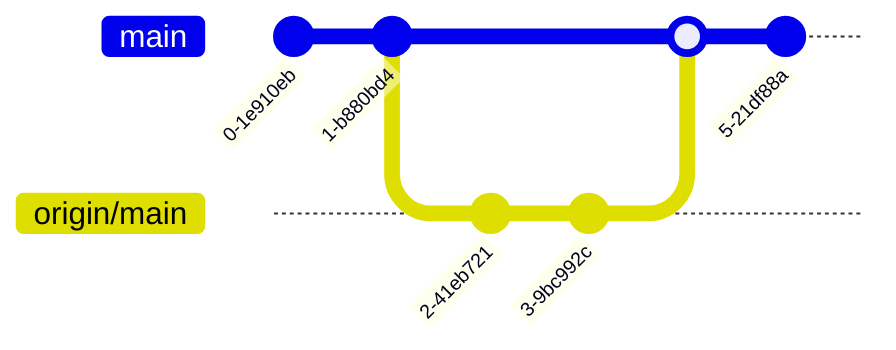

# 初识Git

## 目录

- [初识Git](#初识git)
  - [目录](#目录)
  - [1 前言](#1-前言)
  - [2 使用场景](#2-使用场景)
  - [3 从本地代码到远程仓库](#3-从本地代码到远程仓库)
    - [3.1 前置准备](#31-前置准备)
    - [3.2 创建仓库](#32-创建仓库)
    - [3.3 下一步尝试](#33-下一步尝试)
    - [3.4 推送至远程仓库](#34-推送至远程仓库)
  - [4 从远程仓库到本地代码](#4-从远程仓库到本地代码)
    - [4.1 第一次拉取](#41-第一次拉取)
    - [4.2 同步远程仓库](#42-同步远程仓库)
      - [4.2.1 Case 1: Fast forward](#421-case-1-fast-forward)
      - [4.2.2 Case 2: Merge (No Conflict)](#422-case-2-merge-no-conflict)
      - [4.2.3 Case 3: Merge (Conflict)](#423-case-3-merge-conflict)
      - [4.2.4 Option: Rebase](#424-option-rebase)
  - [5 合并分支](#5-合并分支)
    - [5.1 合并前暂存未提交的修改](#51-合并前暂存未提交的修改)
    - [5.2 合并单条commit](#52-合并单条commit)
  - [6 “规范”的代码仓库其他建议](#6-规范的代码仓库其他建议)
    - [6.1 Git配置](#61-git配置)
    - [6.2 提交信息](#62-提交信息)
    - [6.3 主分支保护](#63-主分支保护)
    - [6.4 谨慎使用破坏性命令](#64-谨慎使用破坏性命令)
    - [6.5 .gitignore](#65-gitignore)
    - [6.6 .gitkeep](#66-gitkeep)

## 1 前言

本分享将包含的内容

- Git基础命令
- 本地仓库（Git）与远程仓库（Github）交互
- 分支管理
- Git的其他注意事项

重点关注内容

- `Pull`、`Merge`命令的使用
- 分支管理

## 2 使用场景

为什么使用Git？

- 规范的项目代码仓库管理
- **代码版本管理和控制**
- 跨设备代码同步
- **团队协作开发**
- 参与开源项目

为什么不使用Git？

- 不安全的命令操作导致不可逆的代码丢失风险
- 需要一定的学习时间成本
- 主要为非纯文本文件的项目（仓库体积膨胀、无法追踪改动）

不适宜用Git管理版本的文件（非绝对）

- 二进制文件（图片、视频、音频等）
- Word、Excel
- 超过100MB的文件

## 3 从本地代码到远程仓库

本小节主要讨论如何从一个本地的代码文件夹出发，建立本地的Git仓库，并将其推送到Github远程仓库。

### 3.1 前置准备

1. 安装Git
2. Github配置SSH连接（可选但强烈建议：Setting->SSH and GPG keys->按照教程操作）
3. 一个初始的项目

### 3.2 创建仓库

打开命令行（CMD/Powershell/Git Bash）切换至项目文件夹目录

```bash
git init
git add .
git commit -m "Initial commit"
```

1. `git init` 初始化一个本地Git仓库
2. `git add .` 将当前目录下所有文件加入缓存区（Staging）
3. `git commit -m "Initial commit"` 将缓存的修改生成一个commit提交至本地仓库

Git的四个区域

1. `Disk`：本地文件夹（工作区）。当前文件夹中所有文件当前状态
2. `Staging`：缓存区（索引）。已缓存的文件修改，等待下一步commit
3. `Local`：本地仓库。
4. `Remote`：远程仓库

### 3.3 下一步尝试

初次提交后，以目前版本代码创建一个节点保存在本地仓库中。此后允许我们

- 继续在当前版本上迭代开发：
  
  ```bash
  echo "This is a tutorial for git" > README.md
  git add README.md
  git status
  git commit -m "Add README"
  ```

- 切换到某一commit版本：
  
  ```bash
  git log
  git checkout ${commit_id}
  git checkout master
  ```

- 回退到某一commit版本：

  方式1：直接撤销并回退到上一个版本

  ```bash
  git log
  git reset HEAD~1
  ```
  
  方式2：创建一个新的commit以覆盖的方式撤销某个版本的修改
  
  ```bash
  git log
  git revert HEAD~1
  ```
  
  `HEAD~1`：HEAD表示本地仓库指针，指向当前最新版本，~N表示回退N个commit。另一种方式是通过`git log`找到需要回退的commit版本，然后使用`git reset ${commit_id}`命令回退到所在版本。

- 新建分支开发不同版本的代码
  
  新建分支`addition`，在该分支上添加新的文件`add.txt`。

  ```bash
  git checkout -b addition
  echo "Additional content" > add.txt
  git add add.txt
  git commit -m "Add additional file"
  ```

### 3.4 推送至远程仓库

现在已经创建了一个基础的本地仓库。假设存在在其他设备上继续开发的需求，或者想与他人共享代码，除了通过文件的形式传输，还可以通过将本地仓库推送至Github远程仓库实现多人或多设备的代码同步。下面将介绍具体的操作步骤，其中大部分命令操作在Github新建仓库上也提供提示。

1. 在Github上创建一个仓库
2. 将本地仓库与远程仓库关联

```bash
git remote add origin ${remote_url}
git remote -v
git push origin master:main
```

这一步中可以看到本地分支和远程分支的名称不一致，这是因为Github默认分支名称为`main`，而本地默认分支名称为`master`，因此需要指定推送的分支名称。除此之外也可以将本地默认分支名称进行修改使其一致，执行命令。

```bash
git branch -m main
git push origin main
```

> [!WARNING] 本地和远程分支名不一致会在推送时带来潜在的麻烦，建议修改保持分支名称一致性

## 4 从远程仓库到本地代码

### 4.1 第一次拉取

先从拉取自己或他人的项目到本地开始。将远程仓库`${remote_url}`的代码克隆倒当前文件夹。先拉取main分支，随后将其他分支逐个拉取至本地。

```bash
git clone ${remote_url}
cd ${repo_name}
git checkout -b addition origin/addition
```

还可以再`clone`时传入参数修改repo的本地文件夹名称，即`git clone ${remote_url} ${local_repo_name}`。第三行命令则是在本地创建一个新的分支`addition`，并将远程仓库的`addition`分支拉取至本地，这样的话就能实现将远程仓库的其他分支拉取至本地的操作了。

### 4.2 同步远程仓库

假设目前已经拉取了远程仓库的代码，但自己在其他设备上或者由他人对远程仓库进行了更新，现需要将远程仓库的修改同步至本地。

```bash
git pull origin main
git pull origin dev:dev
```

第一行命令指从远程仓库`origin`的`main`分支拉取最新的代码和当前分支合并。如果需要合并的是其他分支则需要使用第二行命令，显式给定分支名。

实际上`pull`命令是`fetch`和`merge`的组合，`fetch`是将远程仓库的代码拉取至本地，`merge`是将远程仓库的代码合并至本地仓库（产生一个Merge的commit提交）。

#### 4.2.1 Case 1: Fast forward

当本地分支并没有产生新的commit时，`pull`操作是非常轻松的，它只是通过`fetch`获取远程仓库的commit记录并在本地同步，随后将`HEAD`指向同步后的最新commit。

在这种情况下看似没有进行`merge`，这是因为`pull`时默认采用`fast-forward`模式，即命令行中默认传入参数--ff。这意味着如果被合并的分支是当前分支的直接下游，那么直觉上就没有必要多创建一个commit了，只需修改`HEAD`指针即可。当然可以通过使用参数`--no-ff`仍然在`merge`时创建一个新的commit（可以但没必要）。


#### 4.2.2 Case 2: Merge (No Conflict)

但是当本地和远程有不同的commit时情况就会稍微复杂些，这个时候则需要涉及到实际的`merge`操作。

假设同时有两个开发者在同一个分支上工作，另一个开发者已经提交了新的commit并推送到远程仓库，此时本地仓库我们自己也有新的commit


假设本地的修改和远程的修改没有冲突，这是最简单的情况，那么`pull`操作会自动合并两个分支的修改，产生一个新的commit（通常情况下会进入vi并在自动生成的commit信息的基础上进行修改或确认）。



#### 4.2.3 Case 3: Merge (Conflict)

当两个开发者在同一行上都做了修改时，这时就会产生冲突，这时机智如Git也没有办法知道怎么取舍代码解决冲突，这时就需要手动解决冲突。在执行`pull`操作后，Git会提示冲突的文件，此时处于未`merge`的状态

```text
<<<<<<< HEAD
I think this is a dog
=======
I believe this is a pig
>>>>>>> branch-a
```

在编辑器中选择其中认为正确的代码，并删除冲突标记符号`<<<<<<<`、`=======`、`>>>>>>>`。解决全部冲突后，即可通过`git add`和`git commit`将合并以及冲突解决的代码作为一个新的commit提交至本地仓库。

#### 4.2.4 Option: Rebase

除了`merge`操作外，还有一种操作是`rebase`，它也是合并分支的一种方式，区别于`merge`的点是`rebase`会将本地的commit放在远程commit的后面，保持提交树的线性。`rebase`操作的结果如下所示


`rebase`的背后原理是舍弃原有的提交，重新构建tree，看似很完美，但并不是所有情况都适合使用的。*如果提交存在于你的仓库之外，而别人可能基于这些提交进行开发，那么不要执行变基*（From Git book）。换而言之，如果确认这个分支只有你一个开发时，即别人不会在该分支上进行额外的`merge`或其他操作，请随意使用`rebase`使得提交tree保持整洁。

## 5 合并分支

合并的分支既可以是远程仓库的分支`origin/main`，也可以是本地仓库的其他分支`dev`

合并其他分支的同样也依赖于`merge`操作。既然通过`pull`操作已经对`merge`有了基础的了解，那么从本地仓库的其他分支合并也和从远程仓库分支合并无异。本章节将介绍除了冲突解决以外，进行分支合并时有哪些事情需要注意，以及可能会使用到的技巧。

### 5.1 合并前暂存未提交的修改

在`pull`或`merge`之前，最好的做法是先将本地的当前的修改进行commit，避免修改的文件和远程仓库/其他分支发生冲突。当然更多情况是目前的修改尚未完全不想形成一次半成品的commit，这时可以使用`stash`将当前缓存区的修改缓存（隐藏）到堆栈中，具体操作如下所示

```bash
git stash
git pull
git stash pop
```

`stash`缓存的是已经处于缓存区的修改，这包含：(1) 通过`git add`加入的新建文件（2）在原有已追踪文件上的修改（不管是否已加入缓存区）。但不包含未加入缓存区（未追踪）的新建文件。恢复堆栈中隐藏的缓存区修改有两种方式：

- 通过`git stash pop`将最新的缓存恢复至工作区（常用）
- 先`git stash list`查看当前缓存区的列表，然后通过`git stash apply stash@{n}`恢复指定的缓存

`stash`除了在进行`pull`和`merge`时存在未提交的修改时发挥作用外，在想要进行分支切换时也能派上用场。对于未追踪的文件来说，使用`checkout`切换分支时，这些文件也会被带到新的分支上，往往这不是我们想要的，我们希望切换后的分支尽可能保持干净。

此时在切换前通过通过`git stash -u`命令缓存所有与当前`HEAD`指向的干净的工作区状态不同的文件，其中`-u`参数意思为缓存未追踪的文件。此后完成另一个分支上的工作后，切换回当前分支，只需要`stash pop`即可避免未追踪的文件在分支间流窜。

> [!TIP] Pull时也可以加入--autostash参数，自动在Merge前后实现stash和stash pop操作。

如果缓存在栈上的修改和Merge后的代码存在冲突时，则在恢复后同样会以冲突标记符号的形式提示冲突，需要手动解决。处理完后并不一定需要commit，只需要add即可。因为发生冲突的部分代码是提交树与缓存区的冲突，这部分冲突的处理可以理解成将当前的缓存修改基于原有的`HEAD`变为基于新的`HEAD`上的修改，那么解决冲突后的修改也就不急着commit

### 5.2 合并单条commit

有时候我们并不希望将其他分支的所有commit都合并过来，而只需要合并其中一个或多个对本分支有同样作用的commit，这个时候需要用到`cherry-pick`命令


此时只需要合并commit **c**，只需要执行`git cherry-pick c`即可，提交树则变为


`cherry-pick`也支持多个commit的合并，如

- `git cherry-pick ${commit hash 1} ${commit hase2}`：合并commit1、commit2
- `git cherry-pick ${commit hash 1}..${commit hash 2}`：合并commit1到commit2之间的所有commit
- `git cherry-pick ${commit hash 1}^..${commit hash 2}`：合并commit1到commit2之间的所有commit，但不包括commit1

## 6 “规范”的代码仓库其他建议

### 6.1 Git配置

这里将介绍一些常用且有用的Git配置

- `git config --global user.name "Your Name"`：设置全局用户名
- `git config --global user.email "Your Email"`：设置全局邮箱
- `git config --global init.defaultBranch main`：设置默认分支名称

`--global`参数将会对本用户所有仓库生效。如果在多人共用账号的服务器上使用时，用户名或邮箱宜只对个人仓库单独配置，即使用`--local`参数替代，此时配置信息将保存在项目根目录的`.git/config`文件中

### 6.2 提交信息

提交信息用于说明本次提交修改的内容，一个好的提交信息应当包括：

1. 提交类型
2. 修改涉及的模块（Optional）
3. 修改具体内容描述

```text
<type>[optional scope]: <description>

[optional body]

[optional footer(s)]
```

一个提交信息的实例，通常只需要第一行就好了

```text
feat (model): model can provide prediction for new data
```

修改类型包括

- `feat`：添加新功能
- `fix`：修复bug
- `hotfix`：紧急修复bug（更加简短的修改）
- `chore`：和修复bug或添加功能无关的改变，不涉及`src`主体代码的修改
- `refactor`：并添加新功能或修复问题的代码重构
- `docs`：仅仅修改文档，如README或其他说明文档
- `style`：不影响代码含义的修改，如空格、格式化等
- `test`：添加或修改测试代码
- `revert`：撤销之前的提交

注：Merge操作产生的commit的提交信息使用默认的即可

另外在提交时应当注意避免使用`git add .`命令将所有文件加入缓存区，而是应当进行筛选后，使用`git add src/xxx`将所需要的部分文件加入缓存区，这样可以保持提交的简洁性或避免将无用的临时文件提交。

### 6.3 主分支保护

一般来说，主分支（`main`）是项目的稳定版本，因此不建议直接在主分支进行直接的修改。如果确信这是个人项目且不会产生其他的分支需求，直接在主分支上修改是可接受的，但不是最佳选择。

为了对主分支进行保护，应当在主分支的基础上创建新的开发分支，在开发分支上完成全部开发、测试工作后，将其合并至主分支。这样可以保证主分支的稳定性，同时也可以保证开发分支的独立性。

### 6.4 谨慎使用破坏性命令

- `git push -f`：强制推送本地仓库覆盖远程仓库，这可能导致他人的commit tree产生混乱
- `git clean`：删除所有未追踪的文件。此删除不可逆，若要使用可加入`-n`参数检视要删除的文件
- `git checkout -f`：当切换存在冲突强制执行，这会导致潜在的未提交的修改丢失
- `git reset --hard`：该命令将放弃工作区和暂存区的所有更改，将存储库恢复到以前的提交。这会导致所有未提交的已追踪文件修改丢失（未追踪的不受影响），请谨慎使用。一般使用`git reset --soft`或`git reset --mixed`（默认方式）是安全的，虽然提交树会重置，但是至少修改未丢失

这些命令也绝非完全不能使用，但在使用前请确保自己知道这些执行命令会发生什么变化，在常规方式发生错误前先熟读报错提示信息，确实没有更合适的方式后再考虑使用这些存在不可逆风险的命令。

### 6.5 .gitignore

`.gitignore`文件是用于告诉项目文件夹中哪些文件或文件夹不希望被Git追踪。即便所有代码或文件是必要的，但仍有可能产生的一些临时文件或日志文件不应当被提交。其中常见的包括

- 编译生成的文件
- IDE或编辑器生成的文件
- 日志文件
- 系统生成文件
- 包含个人账号信息或数据的敏感信息文件（千万不要将该信息push到远程仓库，尤其是设置为公开的仓库）

`.gitignore`的匹配模式和语法请参考[文档](https://git-scm.com/docs/gitignore/zh_HANS-CN)。下面给出一个Python项目的简化版本`.gitignore`文件示例

```.gitignore
# python temp files
__pycache__/
*.egg-info/

# log files
*.log
logs/

# IDE files
.idea
.vscode
.vs

# system files
.DS_Store

# >>> Custom ignore starts here >>>

password.json  # e.g.

# <<< Custom ignore ends <<<
```

`gitignore`不影响已追踪的文件，要想忽略已追踪的文件，需要先执行`git rm --cached ${file}`将其从缓存区删除，然后再将该文件添加到`.gitignore`文件中。

### 6.6 .gitkeep

Git默认不追踪空文件夹，但是如果想改变这一默认行为将空文件夹加入追踪，则可以创建一个空的文件命名为`.gitkeep`，即可实现这一效果

另一种场景是当文件夹中包含一些数据文件不需要进行提交，但是又需要将该文件夹本身进行提交。此时在文件夹内创建一个`.gitkeep`文件后，配合`.gitignore`使用即可

```.gitignore
FOLDER_NMAME/*
!FOLDER_NAME/.gitkeep
```
